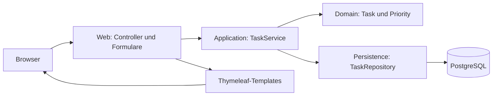

# Architektur

Status: angenommen am 24.09.2026; technische Grundlage P00–P02 implementiert und geprüft; Anlegen, Anzeigen, Umbenennen, Statuswechsel und Löschen einschließlich Web-/Anwendungslogik (P03–P05) geprüft. Begründung und Alternativen stehen in [ADR 0001](decisions/0001-architecture-baseline.md).

## Aufbau

Ein Maven-Modul, eine Java-Anwendung, eine PostgreSQL-Datenbank. Spring MVC verarbeitet Formularanfragen und rendert Thymeleaf-Templates. Es gibt keinen separaten Frontend-Build und keine öffentliche JSON-API.



Die Grafik zeigt den Laufzeitfluss. Die folgenden Regeln legen die Codeabhängigkeiten fest.

## Zuständigkeiten und Grenzen

| Bereich | Darf | Darf nicht |
|---|---|---|
| task.web | Formulare binden, Eingaben validieren, Service aufrufen, View-Daten darstellen, Fehler in HTTP übersetzen | Repository direkt aufrufen, Transaktionen oder Geschäftsregeln verwalten |
| task.application | Use-Cases koordinieren, Transaktionen begrenzen, Clock verwenden, Repository aufrufen, unveränderliche Ergebnisdaten zurückgeben | HTTP, Templates, Servlet- oder Model-Typen verwenden |
| task.domain | Task-Zustand und Invarianten kapseln; JPA-Mapping tragen | Controller, Services, Repository oder Webframework kennen |
| task.persistence | Spring-Data-JPA-Repository für Task bereitstellen | HTTP verarbeiten, Geschäftsentscheidungen treffen |
| config | Clock und technische Laufzeit-/Sicherheitskonfiguration bereitstellen | Fachliche Task-Abläufe implementieren |
| Templates | Bereits aufbereitete Daten darstellen; Formulare mit Fehlermeldungen rendern | Datenbankzugriff oder fachliche Zustandsänderungen durchführen |

Erlaubte Paketabhängigkeiten: web → application/domain; application → domain/persistence; persistence → domain. Die Domain ist bewusst nicht vollständig frameworkfrei: JPA-Annotationen sind erlaubt. Ein zweites Persistenzmodell oder generische Repository-Abstraktionen werden für diesen Umfang nicht eingeführt.

Keine Entity wird direkt als Formularmodell gebunden. IDs stammen aus dem Pfad; created und bestehende priority sind über Änderungsformulare nicht schreibbar. View-Daten werden innerhalb des Service-Aufrufs erzeugt. Open Session in View wird deaktiviert.

## Datenfluss und Transaktionen

1. Browser sendet eine Formularanfrage an den Controller.
2. Der Controller prüft Form und Typen; ungültige Werte führen zur erneuten Anzeige mit Feldfehlern.
3. TaskService führt einen klar benannten Use-Case innerhalb einer Transaktion aus.
4. Das Repository liest oder speichert die betroffene Task-Entity.
5. Erst nach erfolgreicher Rückkehr aus der Transaktion erfolgt ein Redirect auf die Liste.

Lesende Abläufe verwenden read-only-Transaktionen. Mutationen laden bestehende Tasks innerhalb ihrer Transaktion und ändern ausschließlich erlaubte Felder. Fachliche Methoden statt beliebiger Setter schützen die Invarianten. Eine injizierte Clock macht die Erstellungszeit testbar.

## Datenbank

Flyway besitzt das Schema. Hibernate prüft mit `ddl-auto=validate`; `update`, parallele SQL-Initialisierung und Schemaänderungen außerhalb von Migrationen sind nicht vorgesehen. Migrationen sind versioniert und nach Verwendung unveränderlich.

PostgreSQL läuft für lokale Entwicklung mit persistentem Volume. Tests verwenden eine isolierte PostgreSQL-Testcontainers-Instanz. Entwicklungsdatenbanken werden für automatisierte Tests nicht verwendet. Alle Verbindungseinstellungen werden konfiguriert; echte Zugangsdaten gehören nicht ins Repository.

## Geplante Struktur

Dieser Baum ist ein Sollbild. Die technische Grundlage und die Web-/Anwendungslogik für Anlegen und Anzeigen sind implementiert; weitere Mutationen folgen in P04/P05.

```text
task-management/
  README.md
  CONTRIBUTING.md
  pom.xml
  mvnw, mvnw.cmd, .mvn/wrapper/
  compose.yaml
  src/main/java/de/sinanucar/taskmanagement/
    TaskManagementApplication.java
    config/
    task/
      web/
      application/
      domain/
      persistence/
  src/main/resources/
    application.yaml
    db/migration/
    templates/tasks/
    templates/error/
    static/css/
  src/test/java/de/sinanucar/taskmanagement/
    task/
    architecture/
  docs/
    REQUIREMENTS.md
    ARCHITECTURE.md
    CONTRACTS.md
    QUALITY.md
    WORK_LOG.md
    decisions/
  tasks/
    plan.md
    todo.md
```

## Bewusste Grenzen

Keine Microservices, CQRS, Event-Bus, generischen Base-Services oder eigene Framework-Schicht. Die Liste wird vollständig geladen; große Datenmengen sind außerhalb des Zielumfangs. Gleichzeitige Bearbeitung mehrerer Nutzer und Konfliktauflösung sind nicht zugesichert. Eine Erweiterung auf öffentlichen oder Mehrbenutzerbetrieb benötigt eine neue Architekturentscheidung.

## Bestätigungsansichten und Rückgängig

Die Webschicht rendert Löschbestätigung und Namensvorschau serverseitig. Das lokale Skript dialogs.js verwendet diese Ansichten zusätzlich in nativen Dialogen; ohne JavaScript bleiben die Seiten direkt bedienbar. Sie verwendet ausschließlich TaskData und Formularmodelle. Die fachlichen Schreiboperationen bleiben im TaskService. Ein Flash-Attribut transportiert den vorherigen Status für die einmalige Rückgängig-Aktion; es wird keine zusätzliche Persistenz oder allgemeine Änderungshistorie eingeführt.
